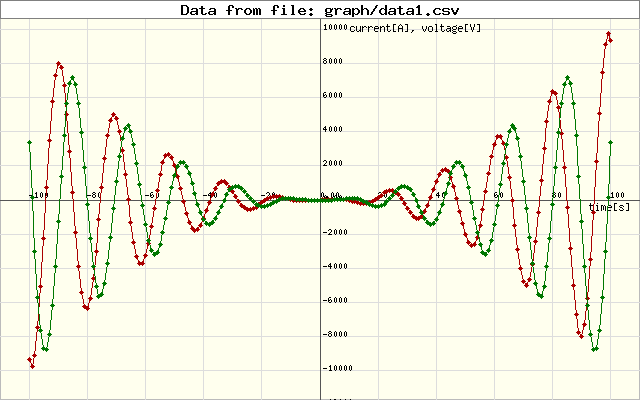

# Marzzelo/Graph

Marzzelo/Graph is a simple Cartesian Graph creation library in PHP, with Laravel support.

 

## Installation

Use Composer to install Graph.

```bash
composer require marzzelo/graph
```

## Usage

### CASE 1: Array of data sets in memory

- Define the datasets to plot in the form: `$data = [[x0,y0], [x1,y1], ...]`
```php
$data1 = [[-1500, 1000], [-1000, 800], [-500, 100], [0, -100], [1000, 900], [1500, 1200]];
$data2 = [[-1500, 1200], [-1000, 1000], [-500, 200], [0, 0], [1000, 1100], [1500, 1400]];
...
$dataN = [...];
```
- Create the datasets using the class **DataSet**. Optionally, you can define the _marker radius_ and _line color_.
```php
$dataset1 = new DataSet($data1, 6, '#070');
$dataset2 = new DataSet($data2, 8, '#600');
...
$datasetN = new DataSet($dataN, 8, '#600');
```

- Define a _frame_ as a canvas for the the Graph using the class **Frame**. Input the
width, height and, optionally, background-color and border-color. 
```php
$frame = new Frame(640, 400, '#FFF', '#bbb');
```

 - Define an **Axis** for the Graph (the _AutoAxis_ concrete class is used in this example). 
   You can choose from the following Axis implementations or create your own one: 
   - **AutoAxis** requires all datasets to be passed in order to auto-calculate axis bounds.
   - **BasicAxis** concrete class requires just the upper-left and lower-right points.
```php
$axis = (new AutoAxis([$dataset1, $dataset2,... $datasetN], $frame ))
// Add labels to the Axis (optional)
        ->addLabels('time[s]', 'current[A], voltage[V]')
// Set grid spacing in physical units (optional)			
        ->setGrid(200, 100);
```

- Define the Graph based on the axis
```php		        
$graph = (new Graph($axis))
         ->addDataSets([
             $dataset1,
             $dataset2,
         ])    
// Get the image to display (render64)
        ->render64('png');
        
// Or, save the image to a file
$graph->render()->save('graph/testgraph.png');
```

Then, you can use `$img64` content as the `image source` in the `` html tag:
```html
<div class=''>
    
</div>
```


### CASE 2: Data sets from a CSV file

- From a CSV file (comma separated values) you can create a **CsvFileReader** object. 
  The first line of the file must contain the column names. 
  The following lines must contain the data in the form: `t, I, V` where `t` is the 
  independent variable and `I` and `V` are the dependent variables. 
  The file must be in the same directory as the script or in a subdirectory. 
  The file name must be passed as a parameter to the constructor. 
  The second parameter is the separator character (default is comma).

|   t   |  I   |  V  | 
|:-----:|:----:|:---:|
| -1500 | 1000 | 100 | 
| -1000 | 800  | 80  | 
| -500  | 100  | 10  | 



```php
$csvFile = new CsvFileReader('data.csv', ",");  // create the CSV file reader
$datasets = $csvFile->getDataSets(); // get the data sets

$datasets[0]->setMarker(5, '#a00'); // set marker radius and color
$datasets[1]->setMarker(5, '#070');

$frame = new Frame(640, 400);  // create the frame
$axis = (new AutoAxis($datasets, $frame ))  // create the axis
    ->addLabels('time[s]', 'current[A], voltage[V]')
    ->setGrid(200, 100);
    ->setTitle('Current and voltage vs time');
    
(new Graph($axis))  
	->addDataSets($datasets) // add the datasets to the graph
	->render()->save('graph/testgraph.png');  // save the graph to a file
```

## Laravel support

### Installation
Don't need to install anything. Autodiscovery is enabled.

### Usage

To create a Frame, use the `Frame` facade:
```php
$frame = Frame::make(640, 400, '#FFF', '#bbb'); // create the frame
```

You can also get a Frame instance using the Graph facade:
```php
$frame = Graph::Frame(640, 400, '#FFF', '#bbb'); // create the frame
```

to create the DataSets, use the `DataSet` facade, or the `Graph` facade:
```php
$data1 = [[-1500, 1000], [-1000, 800], [-500, 100], [0, -100], [1000, 900], [1500, 1200]];
$data2 = [[-1500, 1200], [-1000, 1000], [-500, 200], [0, 0], [1000, 1100], [1500, 1400]];

$dataset1 = Graph::DataSet($data1, 8, '#F00'); // create the dataset
$dataset2 = Graph::DataSet($data2, 8, '#F0F');
```

Or, get the data from a CSV file using the `Graph` facade:
```php
$csvFile = Graph::CsvFileReader($source, $sep);  // create the CSV file reader
$datasets = $csvFile->getDataSets(); // get the data sets
```

The same applies to the Axis and Graph facades:
```php
$axis = Graph::AutoAxis([$dataset1, $dataset2], $frame, [5, 10]) // Create the axis and set the grid spacing
	->addLabels(['time[s]', 'current[A], voltage[V]']) // Add labels to the axis
	->setGrid($gridx, $gridy) // Set the grid spacing
	->setTitle($title); // Add a title to the graph
```

Finally, to create a Graph, use the `Graph` facade:
```php
 Graph::make($axis)  // Create the graph
    ->setDataSets($this->datasets)  // Add the datasets
    ->render()->save($destination);  // Save the graph to a file
```


## Contributing

Pull requests are welcome. For major changes, please open an issue first to discuss what you would like to change.

Please make sure to update tests as appropriate.

## License

[MIT](./LICENSE.md)